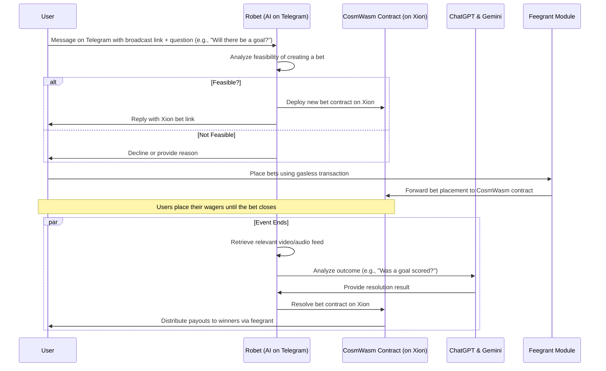

### ROBET – Decentralized AI-Powered Prediction Markets Platform

---

## **Introduction**  
ROBET is a decentralized, AI-powered Prediction Markets platform designed to empower users to create and participate in bets on **any event**. Unlike traditional platforms like Polymarket, ROBET removes the restrictions of whitelisting and human resolvers, enabling **real-time, scalable, and transparent betting**.

---

## How we do it?

---

## **Features**  
### 1. **Seamless Bet Creation**  
- Users create bets by sharing a broadcast link (e.g., sports matches, political speeches) with a question like:  
  *“Will a goal be scored in the next minute?”*  
- ROBET analyzes the feasibility and deploys a **smart contract bet** on the **Xion blockchain**, providing users with a **Xion Bet** link for participation.  

### 2. **Gasless Transactions via Feegrant Module**  
- ROBET integrates the **feegrant module** on Xion, allowing users to participate in bets without paying gas fees directly.  
- This ensures seamless transactions and lowers entry barriers for users.

### 3. **AI-Powered Resolution**  
- ROBET retrieves video or audio feeds post-event and uses AI models like **ChatGPT** and **Gemini APIs** to determine outcomes.  
- Winners receive their rewards instantly via blockchain, ensuring transparency and speed.  

### 4. **Incentivized Bet Creators**  
- ROBET rewards bet creators, introducing a **creator economy** for interactive, engaging bets.  
- Content creators can add live bets during streams to enhance audience engagement.  

### 5. **Decentralized and Scalable**  
- CosmWasm contracts ensure trustless execution and payout.  
- AI handles a large volume of custom, short-term bets without delays.  

---

## **How It Works**  

### **Step 1: Creating a Bet**  
1. Send a tweet with a broadcast link (e.g., a YouTube stream or sports match) and your question.  
2. ROBET evaluates the question’s feasibility in real time.  
3. If valid, ROBET creates a **CosmWasm contract** on Xion and replies with a **Xion Bet** link for user participation.  

### **Step 2: Joining a Bet**  
1. Participants click on the Xion Bet link and join the bet using gasless transactions via the **feegrant module**.  
2. Funds are held in the smart contract until the event resolves.

### **Step 3: Resolving the Bet**  
1. Once the event ends, ROBET retrieves relevant feeds.  
2. AI (using **ChatGPT** and **Gemini APIs**) determines the result.  
3. Winners are automatically awarded their share of the pot directly to their wallets via the feegrant module.  

---

## **Technical Architecture**  

### **Blockchain Integration**  
- **Platform**: Xion (CosmWasm Contracts)  
- **Features**:  
  - Smart contract deployment for bet execution.  
  - Gasless transactions using the **feegrant module**.  
  - Transparent, fast, and low-cost on-chain transactions.  
- **Tools Used**:  
  - **CosmWasm SDK** for smart contract development.  
  - **Feegrant Module** for gasless transaction support.  

### **AI Integration**  
- **APIs Used**:  
  - **OpenAI’s ChatGPT API** for natural language understanding and event outcome analysis.  
  - **Gemini APIs** for advanced media processing (video/audio feed analysis).  
- **Key Roles**:  
  - Feasibility analysis for bet creation.  
  - Outcome resolution with high accuracy and scalability.

---

## **Key Benefits**  
1. **Real-Time Bets**: Create and resolve bets instantly—no human delays.  
2. **Broad Event Coverage**: From sports and politics to niche topics, ROBET supports it all.  
3. **Gasless Transactions**: Feegrant module integration removes barriers for users.  
4. **Fast Payouts**: Blockchain-powered payouts ensure instant rewards.  
5. **Incentives for Creators**: Reward bet creators, fostering a creator-driven economy.  
6. **Trustless and Transparent**: Decentralized execution ensures fairness and security.  

---

## **Usage**  
1. Send your bet creation query on Twitter, including a valid broadcast link.  
2. Wait for ROBET’s response with a Xion Bet link on Telegram.  
3. Join the bet using gasless transactions via the feegrant module.  
4. Receive payouts if you win! 🎉  

---

## **Contributing**  
We welcome contributions! 🚀  
1. Fork the repository.  
2. Create a new branch for your feature.  
3. Submit a pull request with a detailed explanation of your changes.  

---

## **License**  
This project is licensed under the **MIT License**. See the [LICENSE](LICENSE) file for details.  

---

Let’s build the future of prediction markets together! 🌟
